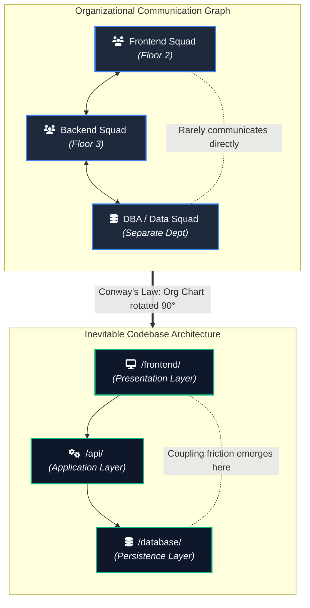
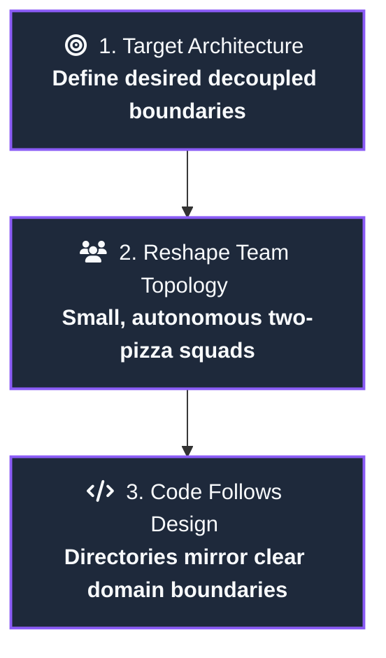
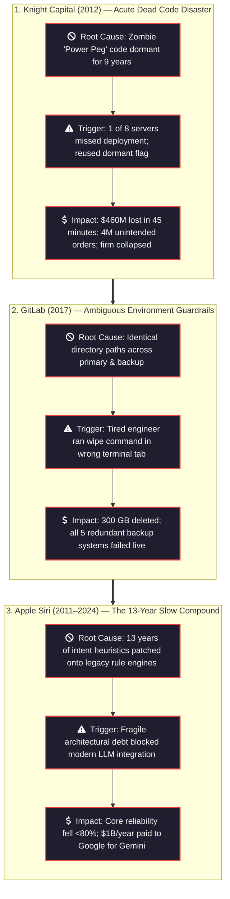
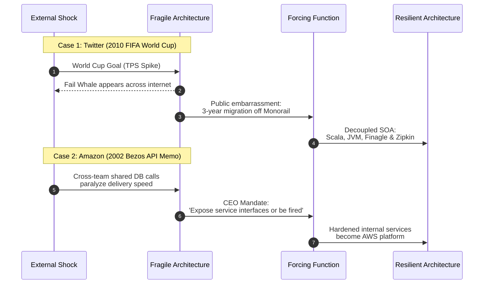

# 📁 Topic 01: File Structure & Codebase Architecture
### *The Architecture of Intent — Where You Put Things Is the Architecture*

[](#-articles-roadmap)
[](#-about-this-topic)

This topic explores the physical organization of production codebases across every experience level—from beginners building their first production service to staff architects and tech leads with 10+ and 15+ years of experience leading enterprise systems. It analyzes why folder layouts create default communication patterns, how technical debt accumulates silently in unowned directories, and how to define crisp module boundaries before external forcing functions break your system.

---

## 📊 Architectural Visuals & Diagrams

### 1. Conway's Law: How Organization Topologies Dictate Directory Structures

When teams communicate in silos, the codebase inevitably mirrors those silos. The directory tree is the organizational chart rotated ninety degrees:



---

### 2. The Inverse Conway Maneuver

Senior architects don't try to solve structural chaos with code refactoring alone. They reshape the communication graph first:



---

### 3. The Spectrum of Structural Failure

Structural debt does not stay inside folders—it leads to high-profile production failures:



---

### 4. Forcing Functions: Why Architecture Refactorings Actually Happen

Teams don't refactor code because clean code is virtuous. They refactor when the cost of living with the broken structure exceeds the cost of tearing it apart:



---

## 🗂️ Topic Structure

```text
01-filestructure/
├── README.md                                  # Topic overview, visuals & article roadmap
└── articles/                                  # 📖 Publication-ready Markdown essays
    ├── README.md                              # Articles index and reading sequence
    └── 01-your-folder-structure-is-a-message.md # Part 1: Full publication essay
```

---

## 📚 Articles Roadmap

| Part | Title | Status | Reading Time | Markdown Article |
| :---: | :--- | :---: | :---: | :---: |
| **01** | **Your Folder Structure Is a Message. Most Teams Are Sending the Wrong One.** | ✅ Ready | ~12 min | [Read Part 1](articles/01-your-folder-structure-is-a-message.md) |
| **02** | **The First Cut: How Module Boundaries Get Drawn and Why They Drift** | ⏳ Planned | ~12 min | Coming soon |
| **03** | **The Blast Radius Audit: Diagnosing Coupling Before It Causes an Outage** | ⏳ Planned | ~12 min | Coming soon |
| **04** | **Decisions That Age Well: Writing ADRs Your Team Will Actually Follow** | ⏳ Planned | ~12 min | Coming soon |
| **05** | **Architecture Without Authority: Leading Structural Alignment as a Senior Engineer** | ⏳ Planned | ~12 min | Coming soon |

---

## 🔬 Core Case Studies & Empirical Data in Part 1

- **Conway's Law & The Inverse Conway Maneuver**: Empirical verification by [MIT and Harvard Business School](https://www.hbs.edu/ris/Publication%20Files/08-039_1861e507-1dc1-4602-85b8-90d71559d85b.pdf).
- **The $460M Dead Code Loss**: Knight Capital's 2012 catastrophe documented in the [SEC Administrative Proceeding](https://www.sec.gov/litigation/admin/2013/34-70694.pdf).
- **GitLab 300GB Database Deletion**: How indistinguishable directory naming contributed to live data loss ([GitLab 2017 Postmortem](https://about.gitlab.com/blog/2017/02/01/gitlab-dot-com-database-incident/)).
- **Apple Siri's 13-Year Structural Debt**: Craig Federighi's confirmation of the failed hybrid attempt and the subsequent $1B/year Gemini licensing deal.
- **Twitter 2010 World Cup Fail Whale**: Eyewitness on-call account and Twitter Engineering's retrospective on migrating off the Monorail to Scala/JVM.
- **Amazon 2002 Bezos Mandate**: How CEO-mandated interface boundaries eliminated coordination friction and accidentally gave birth to AWS.
- **Global Technical Debt**: Stripe's landmark global research study, [The Developer Coefficient](https://stripe.com/files/reports/the-developer-coefficient.pdf), detailing the $300B annual cost of technical debt and maintenance, paired with [Martin Fowler's Technical Debt](https://martinfowler.com/bliki/TechnicalDebt.html) architectural framework.

---

## 🧭 Navigation
- [← Back to Master System Design Index](../README.md)
