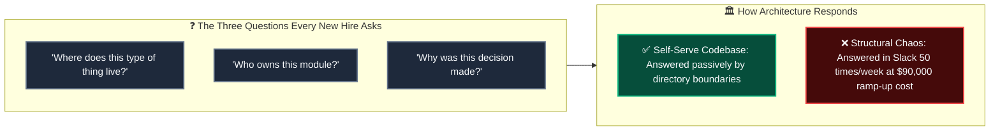
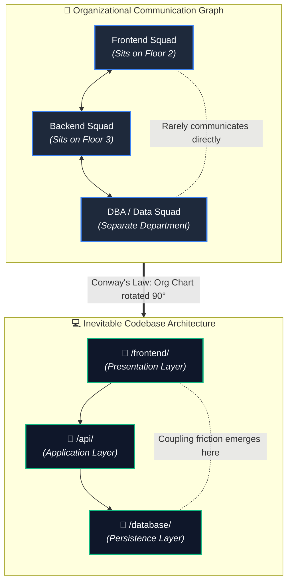
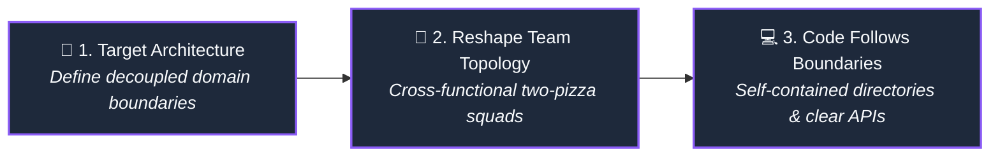
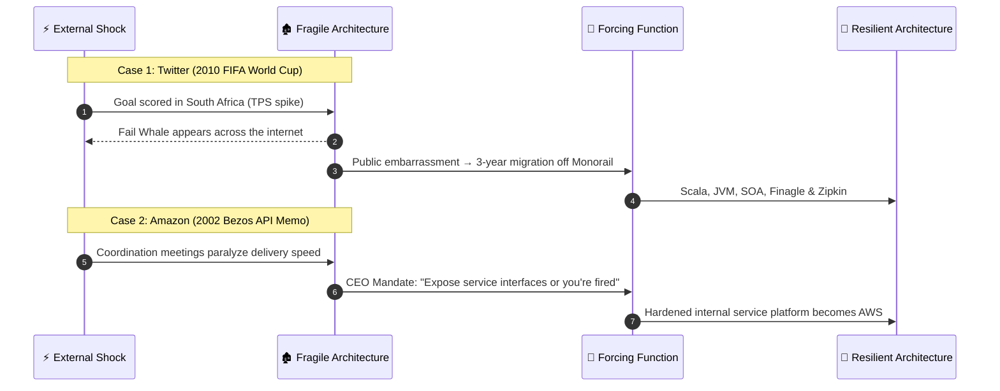
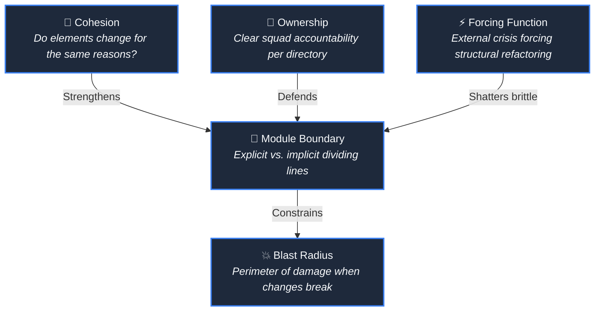

# Your Folder Structure Is a Message. Most Teams Are Sending the Wrong One.

*Part 1 of a series on software architecture for engineers who already know how to write good code — and are starting to wonder why it keeps getting harder to change.*

---

## The Question Nobody Asks Out Loud

There is a question that surfaces in every engineering team, in every company, in every codebase larger than a weekend project. It surfaces during pull request reviews, during onboarding walkthroughs, and during architecture discussions that began about something else entirely.

The question is: *where does this go?*

Not where should it go in theory. Where does it actually belong right now, given the directories that already exist, the conventions established by engineers who left eighteen months ago, and the unspoken rules everyone follows until a new hire touches the wrong file?

A few years ago, a senior engineer joined Slack's iOS team, stepping into a codebase containing over 13,000 files spread across 27 top-level directories. That engineer spent their first three months not shipping features, but building a map. Not a literal document, but a fragile mental model of where business logic hid, which directories were actively maintained versus silently abandoned, which modules had undocumented side effects, and which services had to be handled with extreme caution because nobody on the floor remembered who wrote them.

Three months. Full salary. Fraction of an output.

This was not an anomaly. It is the quiet industry baseline.

Consider what that ramp-up actually costs. Industry data shows that a senior engineer earning $180,000 annually requires roughly six months to reach full productivity in a mid-to-large production system. That translates to a $90,000 investment before an organization sees a single dollar of net-positive return on that hire. Multiply that figure across three senior hires in a single fiscal year, and onboarding friction stops being an engineering inconvenience. It becomes a board-level number.

Research from Sourcegraph into developer productivity demonstrates that the engineering organizations with the fastest ramp-up times do not possess superior documentation. They possess codebases that are self-serve. New hires can answer their own questions simply by navigating the directory tree, rather than pulling a senior engineer out of deep focus every forty minutes to ask where an error handler belongs.

Every new engineer asks the same three fundamental questions within their first thirty days: *Where does this type of thing live? Who owns this module? Why was this decision made?*

All three are questions about structure. None of them are answered in a README.

> "The 'where do I put this file' question is not a junior engineer problem. It is a system design failure that the structure never answered."

---

## Structure Is Not Aesthetic. It Is Communication.

The industry usually frames folder organization as a cosmetic debate. Teams argue passionately over layer-based organization versus feature-based organization, domain-driven boundaries versus technical separation, shallow trees versus deeply nested packages. Engineers defend their choices as matters of personal style or developer ergonomics.

They are not matters of taste. They are matters of communication.

Every directory created in a repository creates a default answer to a question that will be asked hundreds of times over the life of the system. A `services/` folder at the top level communicates that business logic is classified by technical mechanism rather than business capability. A `shared/utils/` directory communicates that its contents belong to everyone, which in production reality means they belong to nobody. A `legacy/` directory communicates that its code should not be touched, which works smoothly until a high-priority feature requires modifying it, and nobody can define what safe modification looks like.

Structure creates defaults. Defaults solidify into patterns. Patterns harden into load-bearing walls in the architecture of a team's collective understanding.

When those defaults are coherent, the structure accelerates velocity. When they are ambiguous, the pattern creates immediate cognitive drag. The `utils/` folder represents the most universal manifestation of this breakdown. As one engineer described the inevitable surrender: *"The PR merged eventually. The file went into utils/ because everyone got tired."* Six months later, that directory contained sixty-one unrelated files, zero cohesive organization, and a quiet reputation across the engineering floor as the place where code goes to retire.

Ward Cunningham [introduced the technical debt metaphor in 1992](https://www.youtube.com/watch?v=pqeJFYwnkjE) to explain to business stakeholders why rushing features creates long-term drag. Taking architectural shortcuts is like borrowing money: you pay compounding interest until the principal is repaid. Modern industry data shows that interest compounding at an unimaginable scale. [CAST Software's analysis](https://www.castsoftware.com/research-labs/technical-debt-estimation) of over ten billion lines of code across forty-seven thousand applications identified sixty-one billion workdays of accumulated technical debt globally. If every professional software engineer on earth halted all feature development today and dedicated their working hours exclusively to remediation, it would require nine uninterrupted years to clear the backlog.

Structural debt does not arrive as a single invoice. It presents as five-minute discussions happening fifty times a week, across a team of twelve engineers, sustained over three years.

---

## Conway's Law: Why This Is Structurally Inevitable

To understand why codebase structures drift into disarray, consider a concrete picture.

Imagine an organization composed of three distinct groups: a dedicated frontend team, a dedicated backend team, and a dedicated database administration team. Each group sits separately, reports to a different manager, and meets on different cadences. Conway's Law dictates that this organization will build a three-tier architecture: a presentation layer, an API layer, and a database layer. They will not build this because an architect decided it was optimal for the business. They will build it because that is how the humans talk to each other.

If you instead reorganize those same engineers into three cross-functional squads—a checkout squad, a payments squad, and an inventory squad—the resulting codebase will inevitably split into three domain-oriented services. The architecture of your software is the organizational chart, rotated ninety degrees.

In 1967, Melvin Conway submitted [a paper to the *Harvard Business Review*](http://www.melconway.com/Home/Committees_Paper.html) outlining this exact dynamic. The editors rejected it as unproven, but Fred Brooks subsequently cemented the insight in *The Mythical Man-Month*: any organization that designs a system will inevitably produce a design whose structure mirrors the organization's communication patterns. Decades later, [MIT and Harvard Business School researchers tested it empirically](https://www.hbs.edu/ris/Publication%20Files/08-039_1861e507-1dc1-4602-85b8-90d71559d85b.pdf), finding that loosely coupled organizations produce significantly more modular, decoupled codebases than tightly coupled ones.

> "Team assignments are the first draft of the architecture."
> — Michael Nygard

> "If the architecture of the system and the architecture of the organization are at odds, the architecture of the organization wins."
> — Ruth Malan

These two observations capture the entire structural challenge. Nygard reminds us that deciding who sits next to whom is the primary architectural choice. Malan warns that if you attempt to impose a clean modular design on a team whose communication channels are fragmented, the organizational reality will tear the architecture apart every single time.

Amazon's famous two-pizza team rule was never merely an HR policy about keeping meetings small. It was an intentional structural maneuver. Jeff Bezos recognized that by limiting a team's size to what two pizzas could feed, and giving that small team absolute, end-to-end ownership of a single service, the team boundary would define the service boundary. The service boundary would dictate the API contract, and the directory layout would naturally follow. Bezos didn't redesign the codebase. He redesigned who talked to whom. The codebase followed.

This is the Inverse Conway Maneuver, formalized by Matthew Skelton and Manuel Pais in [*Team Topologies*](https://teamtopologies.com/book). When faced with Conway's Law, junior engineers often feel resigned to organizational dysfunction. Senior engineers recognize the Inverse Conway Maneuver as an architectural lever: to fix your software's structure, you start by reshaping the team's communication boundaries.

---

## Every Folder Has a Story. Most Teams Have Forgotten It.

Structural decay rarely begins with deliberate negligence. It begins with local decisions that felt completely reasonable in the moment, isolated from their broader architectural consequences.

Consider what happens inside an enterprise monorepo when a team creates a top-level shared folder. As an engineer working in an Nx monorepo summarized: if your repository has twelve applications and one giant shared library, you do not have an architecture; you have a countdown to technical debt. Any component, utility, or data model that seems even remotely reusable gets tossed into the shared bucket without structural review. The `utils/` folder is not a folder; it is a symptom. It grows exactly as fast as the team's willingness to have the "where does this go" conversation.

Then look at the `docs/` folder present in almost every repository older than eighteen months. Inside, you find an initial onboarding guide from sprint one, a burst of markdown files written during an all-hands documentation push, and an architecture decision records directory containing three ADRs from 2021. Nobody updates it, yet nobody deletes it. It lingers because it once served a purpose, the purpose dissolved, and the codebase provides no clear signal indicating that the content has rotted.

When ambiguous structure meets production pressure, the outcome shifts from inconvenience to catastrophe.

```mermaid
flowchart TD
    subgraph K["1. Knight Capital (2012) — Acute Dead Code Catastrophe"]
        K1["Zombie 'Power Peg' code left dormant for 9 years"]
        K2["1 of 8 servers missed deploy; reused config flag"]
        K3["💥 $460 Million lost in 45 minutes; firm collapsed"]
        K1 --> K2 --> K3
    end

    subgraph G["2. GitLab (2017) — Ambiguous Environment Guardrails"]
        G1["Fatigued engineer working across multiple open terminal tabs"]
        G2["No visual signal in directory names; ran wipe on Primary"]
        G3["💥 300 GB deleted; all 5 backup replication systems failed"]
        G1 --> G2 --> G3
    end

    subgraph S["3. Apple Siri (2011–2024) — The 13-Year Slow Compound"]
        S1["13 years of intent-classification heuristics patched over rules"]
        S2["Core feature reliability dropped to 66–80%; hybrid failed"]
        S3["💥 $1B/year paid to Google for Gemini; leadership removed"]
        S1 --> S2 --> S3
    end

    classDef disaster fill:#1e1e2e,stroke:#ef4444,stroke-width:2px,color:#f8fafc;
    class K1,K2,K3,G1,G2,G3,S1,S2,S3 disaster;
```

On August 1, 2012, Knight Capital Group prepared to participate in the New York Stock Exchange's new Retail Liquidity Program. Engineers updated their automated routing engine, SMARS, and repurposed an existing internal configuration flag that had historically activated an obsolete testing function known as Power Peg. Power Peg had been officially deprecated in 2003, but its underlying code was never excised from the repository. When the update was deployed across eight production servers, an engineer missed a manual deployment step on the eighth machine. That server continued running the previous year's binary. When trading opened, the repurposed flag instructed that server to run Power Peg. Within forty-five minutes, the system executed four million unintended transactions across 154 equities, accumulating over seven billion dollars in erroneous positions and costing Knight Capital $460 million. The company collapsed and was acquired. The [SEC's administrative proceeding](https://www.sec.gov/litigation/admin/2013/34-70694.pdf) documented the mechanism: dead code left lingering in an ambiguous directory, repurposed configuration flags, and a directory layout that failed to signal what was active versus obsolete.

On January 31, 2017, an exhausted database reliability engineer at GitLab was troubleshooting persistent replication lag late at night. Working across multiple terminal windows connected simultaneously to primary and secondary database instances, the engineer intended to execute a resync command on the failing secondary replica. He executed it on the primary database instead. Three hundred gigabytes of live production data were wiped clean within seconds. Of five redundant backup and replication mechanisms deployed, none functioned under live recovery conditions. GitLab survived by restoring from a six-hour-old manual staging snapshot and [published their full postmortem publicly](https://about.gitlab.com/blog/2017/02/01/gitlab-dot-com-database-incident/). Identical directory names across environments left an engineer working under fatigue with no clear visual guardrails, while critical disaster recovery procedures existed only as unverified text in forgotten folders.

The most expensive structural failure in software history, however, was not an acute outage. It was a thirteen-year slow-motion drift. When Apple launched Siri in 2011, it was built on a first-generation intent-classification architecture. Over thirteen years, engineers patched limitations and stitched legacy rule-based components onto newer machine learning models until internal evaluations revealed that core Siri features were operating with only 66 to 80 percent reliability. In 2025, software engineering chief Craig Federighi confirmed that the hybrid attempt had failed; the 2011 architecture could not be extended and had to be rebuilt from scratch. Apple entered an agreement to pay Google an estimated one billion dollars annually to license Gemini models, while its vice president of AI was removed from Siri leadership and the entire team restructured.

> "Structure doesn't fail loudly. It fails slowly, in incidents and forgotten decisions and new hires who stop asking questions."

---

## Structure Changes When Forcing Functions Hit

Engineering teams almost never undertake comprehensive architectural refactoring simply because they recognize that clean code is virtuous. They refactor when an external forcing function arrives—an event that causes the daily cost of living with the broken structure to dramatically exceed the agonizing cost of tearing it apart.

Consider the breaking point Twitter experienced during the summer of 2010.

The company was running on a massive monolithic Ruby on Rails application internally referred to as the Monorail. Components were tightly coupled, data stores were shared indiscriminately, and a localized failure inside a peripheral feature could instantly bring down the entire site. Then the FIFA World Cup kicked off in South Africa.

An eyewitness engineer on call during the tournament documented the reality on his blog: *"Going into the World Cup it was pretty well established that we were going to have issues. We were already pretty well known for the 'Fail Whale' at this point, but we had bent over backwards trying to prepare. We nearly doubled the web servers, added MySQL replicas, and tried to clear out as much unnecessary cruft as possible. Everybody's got a plan until they get punched in the mouth. The very first game managed to cause our site to start throwing errors."*

Twitter's official engineering blog subsequently corroborated what the architecture was subjected to: *"The influx of Tweets — from every shot on goal, penalty kick and yellow or red card — repeatedly took its toll and made Twitter unavailable for short periods of time. Engineering worked throughout the nights during this time, desperately trying to find and implement order-of-magnitudes of efficiency gains. After that experience, we determined we needed to step back. We then determined we needed to re-architect the site."*

A series of goals scored inside stadiums in Johannesburg and Cape Town triggered a three-year architectural transformation in San Francisco. Twitter abandoned the Monorail, migrated core services to the JVM and Scala, and built the distributed primitives—such as Finagle and Zipkin—that eventually reshaped the entire cloud ecosystem. Every goal in South Africa became a forcing function that turned architectural debt into global public embarrassment.

Yet the most consequential forcing function in modern software history was not triggered by an infrastructure crash. It was triggered by an executive memo.

Around 2002, Amazon was struggling with an internal codebase that had become an organizational bottleneck. Teams were reading directly from each other's databases, establishing covert shared-memory connections, and building brittle dependencies that made independent deployments terrifying. Recognizing that coordination meetings were paralyzing the business, Jeff Bezos issued a mandate that changed software engineering forever:

> "All teams will henceforth expose their data and functionality through service interfaces. Teams must communicate with each other through these interfaces. There will be no other form of interprocess communication allowed: no direct linking, no direct reads of another team's data store, no shared-memory model, no back-doors whatsoever. Anyone who doesn't do this will be fired. Thank you; have a nice day."

That ultimatum was a pure organizational forcing function. It did not originate from an unexpected traffic spike; it originated from an executive refusing to tolerate the astronomical cost of cross-team coordination. When Amazon's engineering teams were forced under threat of termination to decouple their data stores and expose standardized interfaces, they inadvertently developed the hardened internal service platform that became Amazon Web Services. AWS exists because Amazon's codebase was structurally broken and Bezos ran out of patience. The forcing function was not a crash. It was a memo.

Forcing functions arrive in several other predictable forms throughout an engineering organization's growth:

The second team joins. A codebase built by four founders functions smoothly because the entire architecture exists as a shared mental model held in four heads. The moment five new engineers arrive and form a second squad, that implicit consensus collapses, and every ambiguous directory becomes a source of cross-team friction.

The regulatory audit arrives. A compliance standard such as SOC 2, HIPAA, or GDPR mandates strict isolation of customer financial or health data. The catch-all `shared/` directory that intertwined sensitive identity records with public catalog logic suddenly becomes a catastrophic regulatory liability requiring an immediate architectural quarantine.

The non-author on-call engineer gets paged. At two o'clock in the morning, an engineer who did not write the original system is awakened by a critical production alert. When directory paths and module names fail to communicate system boundaries and data flow, an incident that should take five minutes to triage stretches into hours of high-stakes guesswork.

---

## What This Series Is and Who It's For

This series is written for software engineers at every stage of their career—whether you are a beginner building your first production service, a mid-level engineer navigating growing codebases, or a staff architect with ten or fifteen years of experience wrestling with enterprise complexity.

If you are early in your journey, this series provides the foundational mental models to navigate production systems without fear and avoid cementing unmaintainable directory layouts from sprint one. If you are an experienced engineer, tech lead, or principal architect with a decade or more in production trenches, it provides the precise vocabulary and organizational levers needed to diagnose architectural rot, conduct fearless structural audits, and align teams around boundaries before external forcing functions break your business.

Regardless of where you sit on that continuum, you have likely shipped software that users rely on, inherited systems you did not build, and experienced the quiet dread of pushing a change to one file only to discover that it inexplicably broke a feature three directories away. This series is for anyone who has sat in a pull request review looking at a proposed change, sensing deep in their gut that something about the design is dangerous, yet struggling to articulate why because our industry rarely teaches a shared vocabulary for structural failure.

To keep these architectural concepts grounded in reality rather than abstract theory, this series introduces a single running example codebase: a production backend for a mid-sized fintech platform. The system handles customer authentication, merchant transactions, double-entry ledger bookkeeping, and third-party webhook dispatches. It is sufficiently complex to expose authentic structural dilemmas, yet compact enough to analyze thoroughly within an article.

Throughout this series, we will examine how structure bends and fractures under production load, how to conduct an architectural audit of an inherited repository without demoralizing the engineers who built it, how module boundaries are established and why they drift over time, how to author architecture decision records that remain valuable three years after they are written, and how to lead architectural alignment across a team that still views folder structures as a matter of personal preference.

This series will not provide you with a universal folder blueprint that you can copy and paste into your next repository. Software engineering contains no universally correct directory trees. It contains only sets of competing trade-offs, and the purpose of this series is to equip you with the mental models and technical vocabulary needed to evaluate those trade-offs deliberately.

---

## A Vocabulary, Before We Go Further

Before we examine the concrete codebase in the next article, we must establish five precise architectural terms that will anchor our analysis.

Blast radius defines the total scope of destruction when a specific component fails or is modified incorrectly. A utility function designed with a tiny blast radius can be refactored or deleted in isolation with complete confidence. A function with an expansive blast radius—such as an unversioned helper living inside a shared folder and imported by forty downstream services—carries the potential to cause a cascading outage across the entire system. Blast radius is fundamentally an attribute of your system's structure, not the cleverness of the code inside the function.

Module boundary represents the dividing line between parts of a codebase that are designed to evolve and change independently. A module boundary is explicit when it is strictly enforced by compiler barriers, distinct packages, private access modifiers, or network contracts. A module boundary is implicit when it relies entirely on team discipline and informal conventions. Implicit boundaries inevitably erode under deadline pressure, while explicit boundaries can be verified and guarded by automated tooling.

Forcing function is an external condition or mandate that makes the ongoing operational cost of maintaining the current architecture exceed the immediate cost of refactoring it. Forcing functions cannot be permanently avoided; they are the natural consequence of organizational growth, traffic surges, and evolving business requirements. Identifying which forcing functions your current repository structure is vulnerable to is the foundation of architectural risk management.

Ownership denotes the clear, unambiguous assignment of responsibility for a module's correctness, performance, and long-term trajectory. Ownership is structurally sound when directory layouts and service definitions make it immediately obvious which engineering squad is accountable for any given file. Ownership becomes ambiguous—and rapidly degrades into collective neglect—when multiple teams can freely modify the same shared logic without a formal protocol for resolving architectural conflicts.

Cohesion measures the degree to which the elements packaged inside a module belong together functionally. High cohesion means that the components within a boundary change at the same time and for the exact same underlying business reasons. Low cohesion means components have been grouped together out of convenience, laziness, or superficial technical similarity. The ubiquitous utility directory containing date formatters, encryption routines, and string sanitizers represents a textbook failure of cohesion.

---

## Where This Leaves Us

The question *where does this go* is not a harmless organizational debate to be resolved by individual preference.

It is the primary design decision that dictates whether your codebase remains comprehensible over time, whether new engineers can reach productivity before their hiring costs compound, and whether your software adapts gracefully to business growth or hardens into an expensive constraint.

Most engineering teams answer the question by accident, PR by PR, until the accumulated friction forces a multi-year rewrite.

In the next article, we open the fintech codebase and confront the very first structural decision: how to draw the initial module boundary in a monolithic codebase that does not yet possess one.

That decision—the placement of the very first boundary—is where software architecture actually begins.

---

*→ Next: Part 2 — The First Cut: How Module Boundaries Get Drawn and Why They Drift*

---

*If this landed, share it with an engineer who's been in the middle of a pull request review thinking “this is wrong, but I can't say exactly why.” That's the person this series is written for.*
