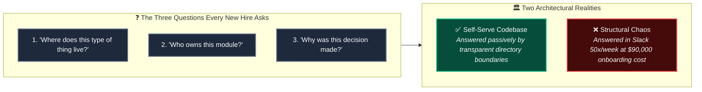
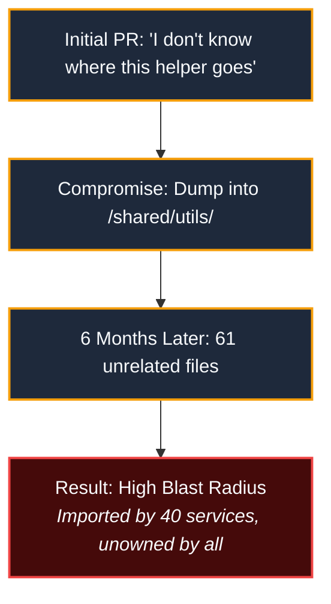
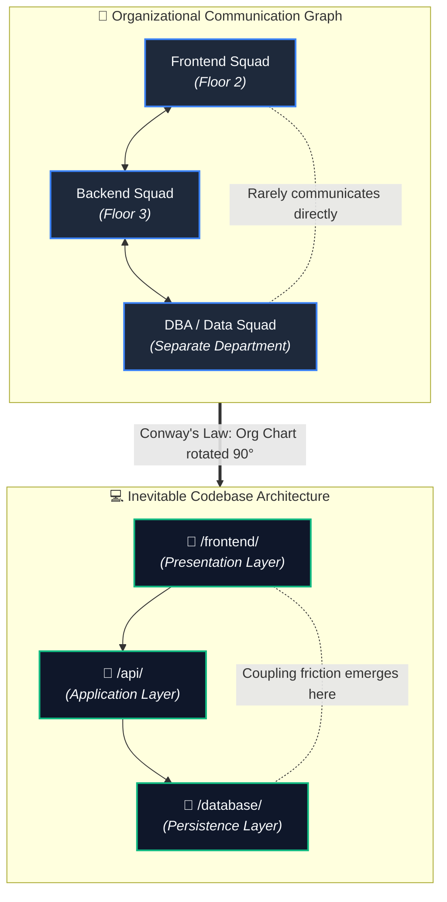
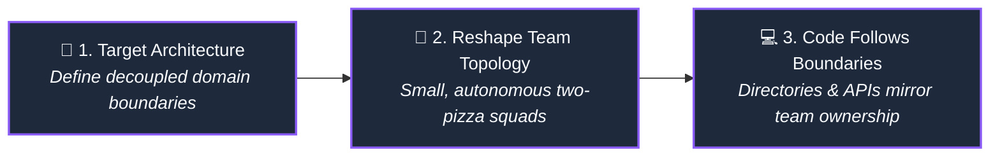
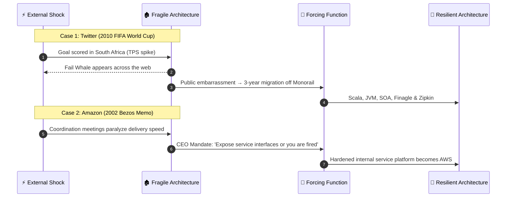
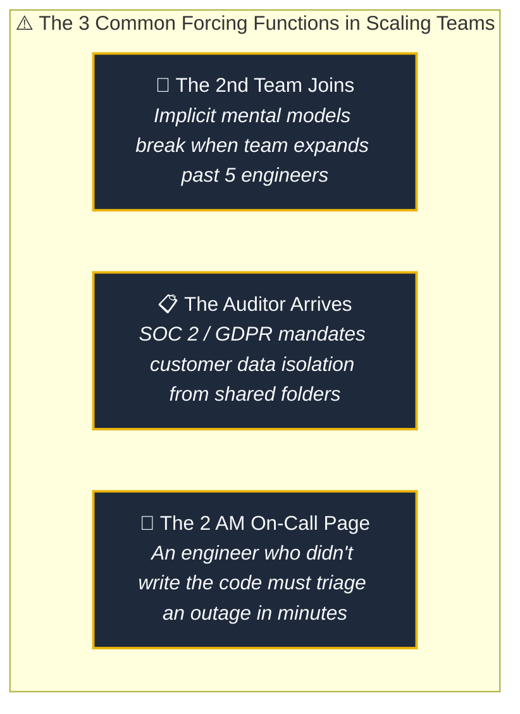
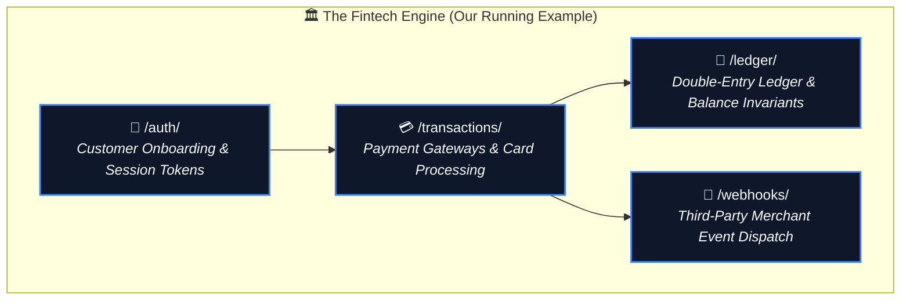
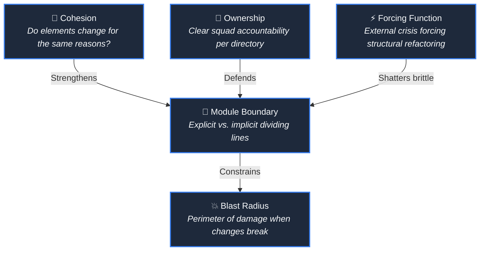

# Your Folder Structure Is a Message. Most Teams Are Sending the Wrong One.

*Part 1 of a series on software architecture for engineers at every stage — from beginners building their first production service to staff architects managing enterprise systems.*

---

## The Question Nobody Asks Out Loud

There is a question that surfaces in every engineering team, in every company, in every codebase larger than a weekend project:

> ***"Where does this go?"***

Not where should it go in theory. Where does it actually belong right now, given the directories that already exist, the conventions established by engineers who left eighteen months ago, and the unspoken rules everyone follows until a new hire touches the wrong file?

A few years ago, a senior engineer joined Slack's iOS team, stepping into a codebase containing over 13,000 files spread across 27 top-level directories. That engineer spent their first three months not shipping features, but building a map. Not a literal document, but a fragile mental model of where business logic hid, which directories were actively maintained versus silently abandoned, and which services had undocumented edge cases everyone worked around by instinct.

Three months. Full salary. Fraction of an output.

Industry data shows that a senior engineer earning $180,000 annually requires roughly six months to reach full productivity in a mid-to-large production system. That translates to a **$90,000 onboarding tax per hire** before an organization sees a net-positive return.

Research from Sourcegraph confirms that high-velocity teams do not have better documentation. They have **self-serve codebases** where new hires can answer their own questions simply by navigating the tree.

> *"The 'where do I put this file' question is not a junior engineer problem. It is a system design failure that the structure never answered."*

---

## Structure Is Not Aesthetic. It Is Communication.

The debate about folder organization is usually framed as cosmetic: layer-based versus feature-based, domain-driven versus technical separation, flat hierarchies versus deeply nested packages.

They are not matters of taste. **They are matters of communication.**

Every directory created in a repository creates a default answer to a question that will be asked hundreds of times over the life of the system:
- A `services/` folder communicates that logic is classified by technical mechanism rather than business capability.
- A `shared/utils/` directory communicates that its contents belong to everyone, which in production means they belong to no one.
- A `legacy/` directory communicates that its code should not be touched—until a priority feature requires modifying it, and nobody knows what safe modification looks like.

Structure creates defaults. Defaults become patterns. Patterns harden into load-bearing walls in the architecture of a team's understanding.

As one engineer described the inevitable surrender: *"The PR merged eventually. The file went into utils/ because everyone got tired."* Six months later, that directory contained sixty-one unrelated files, zero coherent organization, and a reputation as the graveyard where code goes to retire.

Ward Cunningham [introduced the technical debt metaphor in 1992](https://www.youtube.com/watch?v=pqeJFYwnkjE): taking shortcuts is like borrowing money—you pay compounding interest until the principal is repaid. [CAST Software's analysis](https://www.castsoftware.com/research-labs/technical-debt-estimation) of 10B+ lines of code across 47,000 applications found **61 billion workdays of accumulated technical debt globally**. 

Structural debt presents as five-minute debates happening fifty times a week, across a team of twelve engineers, sustained over three years.

---

## Conway's Law: Why This Is Structurally Inevitable

To understand why codebase structures drift into disarray, look at the humans building them.

If an engineering organization consists of three separate teams—frontend, backend, and DBA—Conway's Law dictates they will build a three-tier architecture: presentation, API, and database layers. Not because an architect designed it, but because that is how the humans talk to each other.

If you instead reorganize those same engineers into cross-functional squads—checkout, payments, and inventory—the codebase splits into three domain services.

In 1967, Melvin Conway submitted [a paper to Harvard Business Review](http://www.melconway.com/Home/Committees_Paper.html) stating: *any organization that designs a system will produce a design whose structure mirrors the organization's communication patterns.* [MIT and Harvard Business School tested this empirically](https://www.hbs.edu/ris/Publication%20Files/08-039_1861e507-1dc1-4602-85b8-90d71559d85b.pdf), proving that loosely coupled organizations produce significantly more modular architectures than tightly coupled ones.

> *"Team assignments are the first draft of the architecture."* — Michael Nygard  
> *"If the architecture of the system and the architecture of the organization are at odds, the architecture of the organization wins."* — Ruth Malan

This is the **Inverse Conway Maneuver**, formalized in [*Team Topologies*](https://teamtopologies.com/book). Jeff Bezos' famous two-pizza team rule was not an HR policy about meetings. By giving small teams end-to-end ownership of a single service, the team boundary dictated the service boundary, the service boundary dictated the API, and the directory layout followed. 

Bezos didn't redesign the codebase. He redesigned who talked to whom.

---

## Every Folder Has a Story: Three Landmark Disasters

Structural decay rarely begins with negligence. It begins with local convenience. But when ambiguous structure meets production pressure, the outcome shifts from friction to catastrophe.

```mermaid
flowchart TD
    subgraph K["1. Knight Capital (2012) — Acute Dead Code Disaster"]
        K1["Zombie 'Power Peg' code left dormant in repository for 9 years"]
        K2["1 of 8 servers missed deploy; reused dormant config flag"]
        K3["💥 $460 Million lost in 45 minutes; firm destroyed"]
        K1 --> K2 --> K3
    end

    subgraph G["2. GitLab (2017) — Ambiguous Environment Guardrails"]
        G1["Fatigued engineer working across multiple open terminal tabs"]
        G2["No visual signal in directory names; ran wipe on Primary replica"]
        G3["💥 300 GB deleted; all 5 redundant backup systems failed"]
        G1 --> G2 --> G3
    end

    subgraph S["3. Apple Siri (2011–2024) — The 13-Year Slow Compound"]
        S1["13 years of intent-classification heuristics patched over rules"]
        S2["Core feature reliability dropped to 66–80%; hybrid LLM merge failed"]
        S3["💥 $1B/year paid to Google for Gemini; leadership removed"]
        S1 --> S2 --> S3
    end

    classDef disaster fill:#1e1e2e,stroke:#ef4444,stroke-width:2px,color:#f8fafc;
    class K1,K2,K3,G1,G2,G3,S1,S2,S3 disaster;
```

**Knight Capital (2012)**: Reused a configuration flag that had activated "Power Peg"—a testing function deprecated in 2003 whose code was never excised. One server missed deployment, ran the old binary, and interpreted the flag as Power Peg. Within 45 minutes, the system executed four million unintended orders, racking up $7 billion in unwanted positions and costing $460 million. The [SEC administrative proceeding](https://www.sec.gov/litigation/admin/2013/34-70694.pdf) documented the root cause: dead code left lingering in an ambiguous directory.

**GitLab (2017)**: A fatigued database engineer troubleshooting replication lag late at night had multiple terminal windows open. Due to identical directory paths across environments, he executed a database wipe on the primary server instead of the secondary replica. Three hundred gigabytes of production data vanished. All five redundant backup systems failed in live recovery conditions. GitLab recovered from an informal 6-hour snapshot and [published their transparent postmortem](https://about.gitlab.com/blog/2017/02/01/gitlab-dot-com-database-incident/).

**Apple Siri (2011–2024)**: Over thirteen years, engineers patched intent-classification heuristics onto legacy rule engines until core feature reliability dropped to 66–80%. In 2025, software engineering chief Craig Federighi confirmed that merging the legacy system with modern LLMs had failed; the 2011 architecture could not be extended and had to be rebuilt from scratch. Apple agreed to pay Google an estimated $1 billion annually to license Gemini models, while its AI leadership was restructured.

> *"Structure doesn't fail loudly. It fails slowly, in incidents, forgotten decisions, and new hires who stop asking questions."*

---

## Structure Changes When Forcing Functions Hit

Engineering teams almost never refactor because clean code is virtuous. They refactor when an external **forcing function** arrives—an event that makes the cost of living with the broken structure exceed the cost of tearing it apart.

During the 2010 FIFA World Cup, Twitter was running on a monolithic Ruby on Rails application called the Monorail. Every goal scored in South Africa brought the site down, displaying the infamous Fail Whale. That public embarrassment forced a three-year migration to Scala and the JVM, producing distributed primitives like Finagle and Zipkin.

Around 2002, Amazon experienced an internal forcing function. Cross-team dependencies and shared database access had ground delivery to a halt. Jeff Bezos issued his legendary mandate:

> *"All teams will henceforth expose their data and functionality through service interfaces. Teams must communicate with each other through these interfaces... Anyone who doesn't do this will be fired. Thank you; have a nice day."*

That memo forced the decoupling that accidentally built Amazon Web Services (AWS). The forcing function was not a crash. It was a memo.

---

## The Running Case Study: The Fintech Engine

To keep architectural concepts grounded, this series introduces a running case study: a **production fintech backend**. 

Starting in Part 2, every architectural principle will be demonstrated against this concrete system:

We will examine how to audit this repository, draw the first module boundary, prevent boundary drift, and protect critical ledger invariants from catch-all utility leakage.

---

## A Vocabulary, Before We Go Further

Before opening the codebase in Part 2, we establish five precise terms:

- **Blast radius** — The scope of impact when a component fails. A function in `/shared/` called by forty services has a massive blast radius. Blast radius is an attribute of structure, not code quality.
- **Module boundary** — The explicit or implicit line between parts meant to evolve independently. Explicit boundaries are enforced by compilers and packages; implicit boundaries rely on goodwill and drift under pressure.
- **Forcing function** — An external event or mandate that makes the operational cost of maintaining the current structure exceed the cost of refactoring it.
- **Ownership** — Unambiguous assignment of responsibility for a module. When everyone owns a shared folder, nobody owns it.
- **Cohesion** — The degree to which components inside a boundary change together for the exact same business reasons.

---

## Where This Leaves Us

The question *where does this go* is not a cosmetic preference. It is the primary architectural decision determining whether your codebase remains navigable or hardens into an expensive constraint.

In Part 2, we open the fintech codebase and address the first real structural challenge: **how to draw the initial module boundary in a monolith that doesn't have one yet.**

That decision—the first boundary—is where software architecture actually begins.

---

*→ Next: Part 2 — The First Cut: How Module Boundaries Get Drawn and Why They Drift*

---

*If this landed, share it with an engineer who's been in the middle of a pull request review thinking “this is wrong, but I can't say exactly why.” That's the person this series is written for.*
