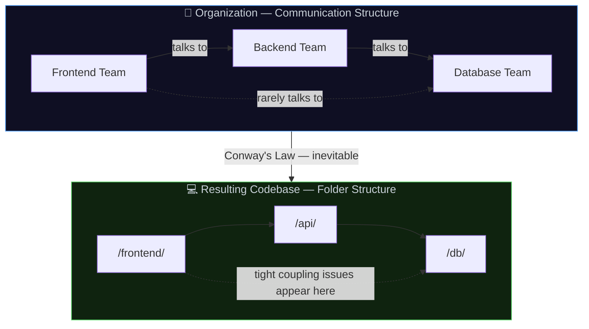
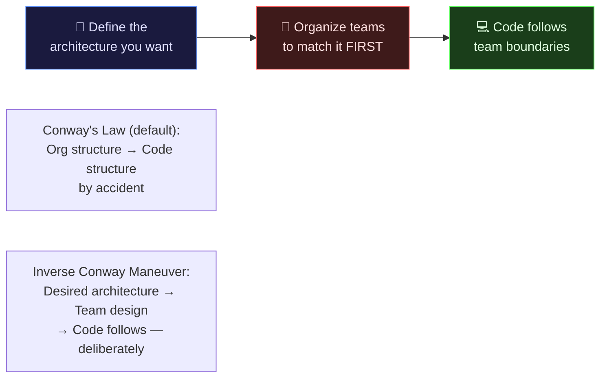
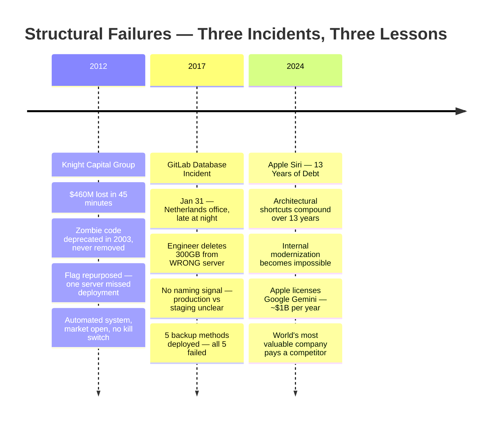
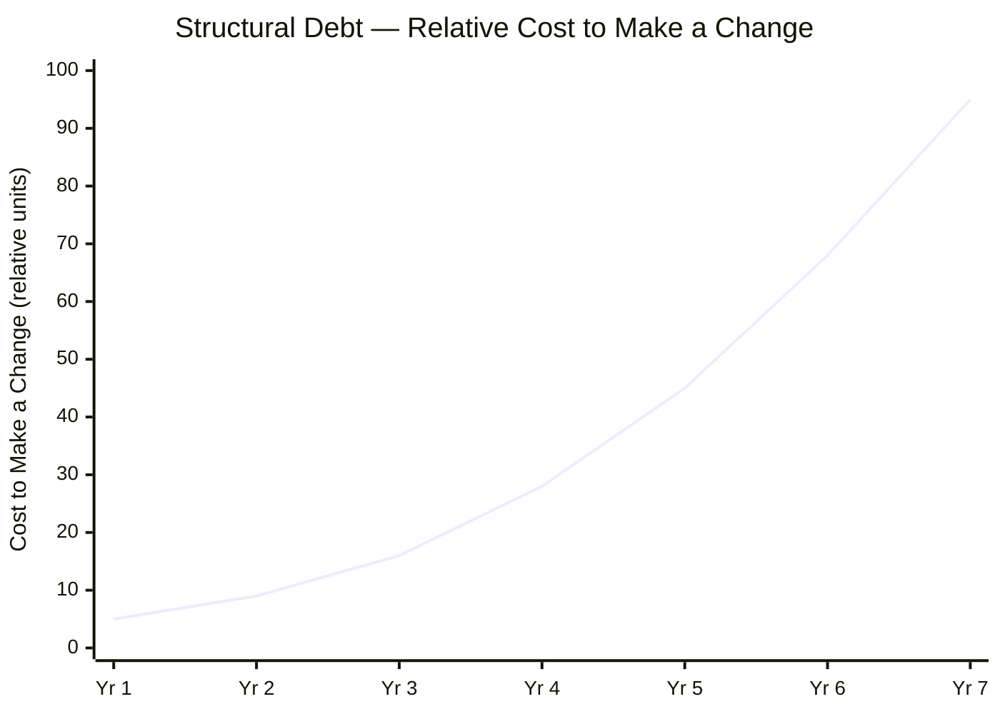
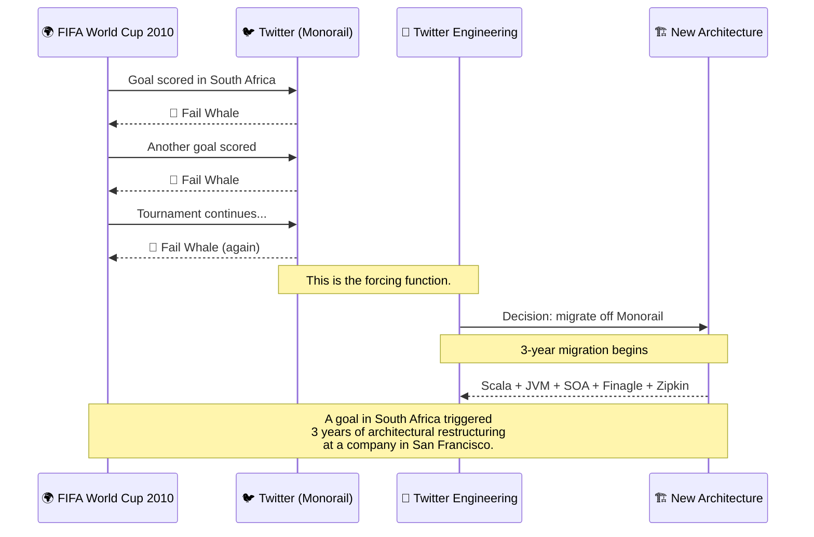
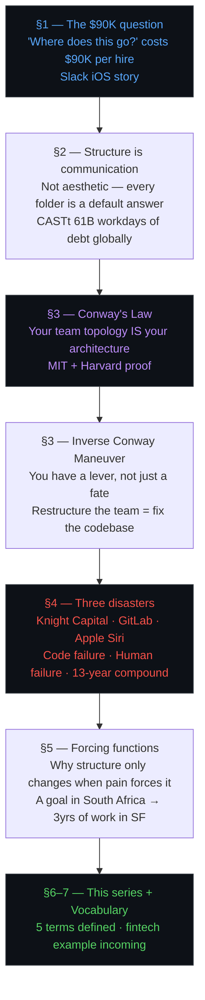

# 📁 The Architecture of Intent
### *Medium Blog Series — Day 1 Research Master File*

> **Series:** Where You Put Things Is the Architecture
> **Article 1:** *Your Folder Structure Is a Message. Most Teams Are Sending the Wrong One.*
> **Audience:** Senior engineers, 2–5 years production experience
> **Word Target:** 2,100–2,400 words
> **Status:** Research complete ✅ | First draft complete ✅

---

## Table of Contents

- [Article 1 — Section Blueprint](#article-1--section-blueprint)
- [Finding 1 — Conway's Law](#finding-1--conways-law)
- [Finding 2 — GitLab 2017](#finding-2--gitlab-2017)
- [Finding 3 — Onboarding Numbers](#finding-3--onboarding-numbers)
- [Finding 4 — Technical Debt](#finding-4--technical-debt-compound-interest)
- [Finding 5 — Inverse Conway Maneuver](#finding-5--inverse-conway-maneuver)
- [Finding 6 — Twitter & FIFA World Cup](#finding-6--twitter--fifa-world-cup)
- [Finding 7 — Apple Siri](#finding-7--apple-siri)
- [Pull Quotes](#pull-quotes)
- [Master Data Table](#master-data-table)
- [Diagrams](#diagrams)
- [Article 1 — Full First Draft](#article-1--full-first-draft)
- [Source Verification](#source-verification)
- [AI Writing Brief](#ai-writing-brief)

---

## Article 1 — Section Blueprint

```
┌──────────────────────────────────────────────────────────────────────┐
│                   ARTICLE 1 — SECTION BLUEPRINT                      │
├──────┬───────────────────────────────────────────────┬───────────────┤
│  §   │  TITLE                                        │  WORD TARGET  │
├──────┼───────────────────────────────────────────────┼───────────────┤
│  1   │  The Question Nobody Asks Out Loud            │    ~300 w     │
│      │  ↳ Slack iOS story                            │               │
│      │  ↳ $90,000 ramp-up cost                      │               │
│      │  ↳ 3 questions new hires always ask           │               │
├──────┼───────────────────────────────────────────────┼───────────────┤
│  2   │  Structure Is Not Aesthetic. It Is            │    ~350 w     │
│      │     Communication.                            │               │
│      │  ↳ Layer-vs-feature folder debate             │               │
│      │  ↳ Default answers problem                   │               │
│      │  ↳ Compound interest of structural debt       │               │
├──────┼───────────────────────────────────────────────┼───────────────┤
│  3   │  Conway's Law: Why This Is Structurally       │    ~250 w     │
│      │     Inevitable                                │               │
│      │  ↳ 1967 Conway + MIT/Harvard empirical proof  │               │
│      │  ↳ Nygard quote                               │               │
│      │  ↳ Malan quote  ← pull quote candidate        │               │
│      │  ↳ Inverse Conway Maneuver                    │               │
├──────┼───────────────────────────────────────────────┼───────────────┤
│  4   │  Every Folder Has a Story. Most Teams Have    │    ~500 w     │
│      │     Forgotten It.                             │               │
│      │  ↳ docs/ graveyard                            │               │
│      │  ↳ Knight Capital — $460M, zombie code        │               │
│      │  ↳ GitLab 2017 — 300GB, human error           │               │
│      │  ↳ Apple Siri — $1B/yr, 13 years of debt      │               │
├──────┼───────────────────────────────────────────────┼───────────────┤
│  5   │  Structure Changes When Forcing Functions Hit │    ~400 w     │
│      │  ↳ Five forcing functions                     │               │
│      │  ↳ Twitter ← 2010 FIFA World Cup goal         │               │
├──────┼───────────────────────────────────────────────┼───────────────┤
│  6   │  What This Series Is and Who It's For         │    ~300 w     │
│      │  ↳ Audience statement                         │               │
│      │  ↳ Running fintech example introduced         │               │
│      │  ↳ Series scope (what it covers / doesn't)    │               │
├──────┼───────────────────────────────────────────────┼───────────────┤
│  7   │  Vocabulary                                   │    ~250 w     │
│      │  ↳ blast radius · module boundary ·           │               │
│      │     forcing function · ownership · cohesion   │               │
├──────┼───────────────────────────────────────────────┼───────────────┤
│  ∎   │  Closing + Link to Article 2                  │    ~120 w     │
└──────┴───────────────────────────────────────────────┴───────────────┘
                                              TOTAL: ~2,470 words
```

---

## Finding 1 — Conway's Law

**Role:** Scientific backbone. Elevates article from "stories" → "structural inevitability."

**The original quote (verified, Datamation 1968):**

> *"Any organization that designs a system will produce a design whose structure is a copy of the organization's communication structure."*
> — Melvin Conway

**Origin story worth knowing:**
- Conway submitted to *Harvard Business Review* in 1967 → **rejected** (editors said he hadn't proved his thesis)
- Published in *Datamation*, April 1968
- Named "Conway's Law" by Fred Brooks in *The Mythical Man-Month*

**Empirical proof:**
Harvard Business School + MIT published *"Exploring the Duality between Product and Organizational Architectures: A Test of the Mirroring Hypothesis"* (MacCormack, Rusnak, Baldwin). Finding: loosely-coupled organizations produce measurably more modular software. Statistically significant. Not a guess.

**What it means:**
The folders in your repo are a map of who talked to whom. If the team was siloed, the codebase is siloed — whether the architecture intended that or not. You don't choose structure in a vacuum. Your team topology chooses it for you, unless you're deliberate.

**Where it fits:** Section 3 — bridge between "structure communicates" (§2) and "every folder has a story" (§4).

---

## Finding 2 — GitLab 2017

**Date:** January 31, 2017
**Role:** Pairs with Knight Capital to cover the full spectrum of structural failure.

**What happened:**

```
GITLAB INCIDENT TIMELINE
══════════════════════════════════════════════════════════
~23:00 CET   Engineer in Netherlands, late at night
             Troubleshooting database load issues
             Two terminal sessions open:
               Session A → primary DB server
               Session B → secondary DB server

~23:07 CET   Runs resync/remove command
             WRONG SESSION — hits the PRIMARY server

~23:07 CET   300 GB of live production data deleted
             in seconds. Engineer kills the process
             immediately — too late.

RECOVERY ATTEMPT — 5 methods, all failed:
  ❌  Automated DB backups     → misconfigured, broken
  ❌  Azure disk snapshots     → not working as expected
  ❌  Replicated slave         → had stopped replicating
  ❌  S3 backups               → not properly configured
  ✅  LVM snapshot             → 6 hours old (only survivor)

OUTCOME:
  Recovered with the 6-hour LVM snapshot
  6 hours of production data permanently lost
  (new accounts, issues, merge requests, comments)
  Git repository data → SAFE (different storage system)
══════════════════════════════════════════════════════════
```

**How it differs from Knight Capital:**

| | Knight Capital (2012) | GitLab (2017) |
|---|---|---|
| **Root cause** | Zombie code in ambiguous location | Ambiguous directory naming |
| **Actor** | Automated trading system | Tired human engineer |
| **Time** | Market open (automated) | Late night (manual) |
| **Backups** | N/A | 5 methods deployed — all failed |
| **Loss** | $460M financial | 300GB + 6hrs of history |

**Notable:** GitLab livestreamed recovery on YouTube. Published live Google Doc notes publicly. Became a landmark in blameless postmortem culture.

**Where it fits:** Section 4, alongside Knight Capital. Two incidents, two failure modes, one root cause: structural ambiguity.

---

## Finding 3 — Onboarding Numbers

**Role:** Gives Section 1's cost argument a board-level spine.

**Ramp-up data (2024–2026 research consensus):**

| Level | Time to 90% Velocity | Month 1 Productivity |
|---|---|---|
| Senior engineer | 6–10 weeks | ~25% of full output |
| Mid-level engineer | 8–14 weeks | ~25% of full output |
| Junior engineer | 4–6 months | ~25% of full output |

**The $90,000 number — how it's built:**

```
Senior engineer salary:   $180,000/year
Ramp-up period:           6 months
Salary cost of ramp-up:   $90,000

Hidden costs on top:
  + Mentor tax: 20–40% of a senior's time for 3 months
  + Opportunity cost: delayed feature delivery
  + Recruiting: 15–25% of annual salary

Conservative 90-day cost:  $40,000–$65,000
Full 6-month total:        $90,000–$195,000
```

**The Sourcegraph insight (2026 research):**
Teams with the fastest ramp-up don't have better paperwork.
They have codebases that are **self-serve** — new hires answer
their own questions by navigating the structure, not by
interrupting someone.

**The 3 questions every new hire asks. All 3 are structure questions:**

```
  "Where does this type of thing live?"    ← structure question
  "Who owns this module?"                  ← structure question
  "Why was this decision made?"            ← structure question
```

**AI acceleration footnote:** Engineers using AI tools daily reach their 10th PR in 49 days vs 91 days without — nearly 50% faster ramp-up. The ones who close the gap fastest are in codebases where they can search and self-navigate.

**Where it fits:** Section 1 — replace vague "3–6 months" with the $90K figure.

---

## Finding 4 — Technical Debt Compound Interest

**Role:** The right metaphor for how structural debt presents in daily work.

**Origin:** Ward Cunningham, 1992. Working on financial software. Wanted to explain to his manager why they needed to refactor. Drew the analogy: every shortcut = borrowing money. The interest = extra effort required to change the code later.

**Best framing for structural debt:**

> *"The first visible effect of technical debt is rarely catastrophic failure. Instead, it appears as friction. Tasks that once required a few hours now take days. Simple changes trigger unexpected regressions. Developers hesitate before modifying certain components because they are unsure how deeply interconnected they are."*

**The global scale number (CAST Software, 2025–2026):**

```
Research scope:
  10 billion+ lines of code
  47,000 applications
  17 countries

Finding:
  61 billion workdays of accumulated technical debt

Thought experiment:
  All 25 million developers in the world
  Working EXCLUSIVELY on debt reduction
  Time to resolve: ~9 years
```

**What structural debt actually looks like day-to-day:**

```
NOT this:
  One catastrophic, visible, expensive event

BUT this:
  "Where does this go?"          ← 5 minutes
  "Who owns this?"               ← 5 minutes
  "Is it safe to touch this?"    ← 5 minutes

  × 50 times per week
  × a team of 12 engineers
  × 3 years
  = millions of dollars in invisible friction
```

**Where it fits:** Section 2 — one paragraph after "structure creates default answers."

---

## Finding 5 — Inverse Conway Maneuver

**Role:** Turns a deterministic law into an actionable engineering lever.

**The law (diagnosis):**
Your codebase *will* mirror your organization. This is not a choice. It is physics.

**The maneuver (prescription):**

```
CONWAY'S LAW — what happens by default
──────────────────────────────────────────────────────────
  Existing org structure  ──────►  Codebase mirrors it
  (siloed, by accident)           (siloed, by accident)


INVERSE CONWAY MANEUVER — what you do deliberately
──────────────────────────────────────────────────────────
  Step 1: Define the architecture you want
  Step 2: Organize teams to match it FIRST
  Step 3: Code follows team boundaries
          (it always does)
```

**Origin:**
- Named in *Team Topologies* (Skelton & Pais, IT Revolution Press, 2019)
- Concept coined by James Lewis at Thoughtworks

**Why it matters for the article:**
A junior engineer hears Conway's Law and feels defeated.
A senior engineer hears the Inverse Conway Maneuver and realizes they have a tool.

*"Restructure the team"* is sometimes the correct answer to *"our codebase is a mess."* You are not fixing the codebase. You are fixing the communication structure that produced it.

**Where it fits:** End of Section 3. The most counterintuitive idea in the article. Most likely to be the most-shared line.

---

## Finding 6 — Twitter & FIFA World Cup

**Role:** Most specific forcing function story in engineering history.

**What most articles say:**
> *"Twitter rewrote from monolith to microservices because it couldn't handle traffic growth."*

**What actually happened:**

```
TWITTER ARCHITECTURE FORCING FUNCTION
══════════════════════════════════════════════════════════

2006  →  Twitter launches on "Monorail"
         Ruby on Rails monolith
         Single large MySQL database
         Tightly coupled — one failure = full outage

2008  →  "Fail Whale" becomes Twitter's mascot
         Every major global event causes outages

JUNE 2010 — 2010 FIFA World Cup, South Africa

         A goal is scored in South Africa.
         Tweets per second spike.
         GOOOOAAAALLL → 🐳 Fail Whale

         Another goal is scored.
         GOOOOAAAALLL → 🐳 Fail Whale

         This happens. Repeatedly. Publicly.
         Throughout the entire tournament.

AFTER THE WORLD CUP:
  Twitter engineering decides: this cannot continue.
  Begin 3-year migration off the Monorail.
  Migrate to Scala + JVM + service-oriented architecture
  Open-source: Finagle (RPC), Zipkin (tracing), Mesos

RESULT:
  A goal scored in South Africa
  triggered a 3-year architectural restructuring
  at a company in San Francisco.

══════════════════════════════════════════════════════════
```

**Source:** Blog post by an actual Twitter engineer (gigamonkeys.com).

**Why this detail is rare:** Most articles say "World Cup traffic." Few say *a specific goal scored was the trigger*. The specificity is what makes it stick in the reader's memory.

**Where it fits:** Section 5 — primary forcing function example.

---

## Finding 7 — Apple Siri

**Role:** The 2026-current story. Proves scale and resources don't protect you from structural debt. Time does the compounding.

**The verified timeline:**

```
APPLE SIRI — 13 YEARS OF STRUCTURAL DEBT
══════════════════════════════════════════════════════════

2011  →  Siri launches with iOS 5
         First mover in voice assistants
         Apple has every competitive advantage

2011
 to   →  13 years of feature additions
2024     13 years of architectural shortcuts
         13 years of structural fragmentation
         No deliberate architectural reset

2024  →  Apple's internal LLM models cannot compete
         Legacy Siri architecture incompatible with
         modern large-scale LLM requirements
         Industry analysts cite "architectural debt"
         as primary reason for inability to modernize

2026  →  Apple licenses Google Gemini
  (iOS    Custom 1.2-trillion-parameter model
  26.4)   Reported cost: ~$1 billion per year
          Multi-year, non-exclusive deal
          Routed through Apple's Private Cloud Compute

══════════════════════════════════════════════════════════
World's most valuable company
writes a $1B/year check to a competitor
because 13 years of structural shortcuts
made internal modernization impossible fast enough.
══════════════════════════════════════════════════════════
```

**The lesson:**
Scale and resources do not protect you from structural debt. Time does the compounding. A structure that felt fine in year 1 becomes the thing that costs you $1 billion per year by year 13.

**Where it fits:** Section 4, after Knight Capital and GitLab. 2–3 sentences. The "13 years" and "$1B/yr" are the numbers that land.

---

## Pull Quotes

Three confirmed, sourced, pull-quote ready lines for Medium's formatting:

```
╔═══════════════════════════════════════════════════════════════════╗
║  PULL QUOTE 1                                                     ║
║                                                                   ║
║  "Team assignments are the first draft of the architecture."      ║
║                                                                   ║
║  — Michael Nygard, Release It!                                    ║
║    (cited in Team Topologies, IT Revolution Press, 2019)          ║
╚═══════════════════════════════════════════════════════════════════╝

╔═══════════════════════════════════════════════════════════════════╗
║  PULL QUOTE 2                                                     ║
║                                                                   ║
║  "If the architecture of the system and the architecture of the   ║
║  organization are at odds, the architecture of the               ║
║  organization wins."                                              ║
║                                                                   ║
║  — Ruth Malan                                                     ║
╚═══════════════════════════════════════════════════════════════════╝

╔═══════════════════════════════════════════════════════════════════╗
║  PULL QUOTE 3  (your own line — use it as pull quote)            ║
║                                                                   ║
║  "The 'where do I put this file' question is not a junior        ║
║  engineer problem. It is a system design failure that the        ║
║  structure never answered."                                       ║
║                                                                   ║
║  — This series (thesis statement)                                ║
╚═══════════════════════════════════════════════════════════════════╝
```

> **Attribution note:** Nygard quote → cite as *Release It!*, mention Team Topologies for discoverability. Malan quote → verified across multiple independent sources.

---

## Master Data Table

| Data Point | Value | Source |
|---|---|---|
| Conway's Law year | 1967 observation / 1968 published | *Datamation*, April 1968 |
| Original paper title | "How Do Committees Invent?" | Melvin Conway |
| HBR rejection | Yes — "failed to prove thesis" | Historical record |
| Named by | Fred Brooks | *The Mythical Man-Month* |
| Empirical proof | MIT + Harvard Business School | MacCormack, Rusnak, Baldwin |
| GitLab incident date | January 31, 2017 | GitLab postmortem |
| Data deleted | 300GB production data | GitLab postmortem |
| Data permanently lost | 6 hours of history | LVM snapshot recovery |
| Backup methods | 5 deployed, all failed | GitLab postmortem |
| Knight Capital loss | $460M in 45 minutes | SEC investigation |
| Knight Capital trades | 4M+ trades, 397M shares, $7B positions | SEC records |
| Power Peg deprecated | 2003 (triggered 2012) | SEC investigation |
| Senior eng ramp-up | 6–10 weeks to 90% velocity | 2024–2026 research |
| Month 1 productivity | ~25% of full capacity | Industry consensus |
| $90K figure | $180K/2 = 6-month salary cost | Industry baseline |
| AI acceleration | 49 vs 91 days to 10th PR (~50% faster) | 2026 research |
| Global tech debt | 61 billion workdays | CAST Software (47K apps, 17 countries) |
| Code analyzed | 10+ billion lines | CAST Software 2025–2026 |
| Resolve time (all devs) | ~9 years | CAST Software model |
| Twitter architecture | "Monorail" — Ruby on Rails monolith | Engineering sources |
| Twitter forcing function | 2010 FIFA World Cup goals | gigamonkeys.com |
| Twitter migration | ~3 years, to Scala/JVM/SOA | Multiple sources |
| Tools open-sourced | Finagle, Zipkin, Apache Mesos | Twitter engineering |
| Siri launch | 2011, iOS 5 | Public record |
| Siri debt duration | 13 years | Public record |
| Gemini deal cost | ~$1B/year (reported) | Multiple financial sources |
| Gemini model size | 1.2 trillion parameters | Technical sources |
| Inverse Conway Maneuver | Named in Team Topologies (2019) | Skelton & Pais |
| Coined by | James Lewis, Thoughtworks | IT Revolution sources |

---

## Diagrams

### Diagram 1 — Conway's Law: Org → Code



---

### Diagram 2 — Inverse Conway Maneuver



---

### Diagram 3 — Three Disasters: A Spectrum



---

### Diagram 4 — Structural Debt: Cost of Change Over Time



> A change costing 5 units in Year 1 costs ~95 units in Year 7.
> The change didn't get harder. The structural debt surrounding it compounded.

---

### Diagram 5 — The Twitter Forcing Function



---

### Diagram 6 — Three Questions, One Root Cause

```
Every new engineer. Every company. Every codebase.
Same three questions. Every time.

  ┌──────────────────────────────────────────────────────────────┐
  │                                                              │
  │  Q1 ── "Where does this type of thing live?"                │
  │                           ↑                                 │
  │                  STRUCTURE QUESTION                          │
  │                                                              │
  │  Q2 ── "Who owns this module?"                              │
  │                           ↑                                 │
  │                  STRUCTURE QUESTION                          │
  │                                                              │
  │  Q3 ── "Why was this decision made?"                        │
  │                           ↑                                 │
  │                  STRUCTURE QUESTION                          │
  │                                                              │
  └──────────────────────────────────────────────────────────────┘

  Good structure answers these passively — through the shape
  of the code itself.

  Bad structure answers them in Slack, 50 times a week.
  At $90,000 per new senior engineer.
```

---

### Diagram 7 — Article Argument Flow



---

## Article 1 — Full First Draft

---

### § 1 — The Question Nobody Asks Out Loud

There's a question that surfaces in every engineering team, in every company, in every codebase larger than a side project. It surfaces during pull request reviews, during onboarding calls, during architecture discussions that started about something else entirely. The question is: *where does this go?*

Not where should it go in theory. Where does it actually go — given the folders that already exist, the patterns that are already established, the implicit rules that nobody wrote down and yet everyone seems to know, until they don't?

A few years ago, a senior engineer joining Slack's iOS team spent their first three months not writing features. They were building a map. Not a literal one — a mental model of where things lived, who owned what, which directories were stable and which were under active construction, which services were trusted and which had undocumented edge cases everyone worked around by instinct. Three months. Full salary. Partial output. And this wasn't unusual — this was the pattern.

Here is what that costs. A senior engineer at $180,000 per year, six months to reach full productivity in a mid-to-large production codebase, is a $90,000 investment before you see full return on that hire. Multiply that across two or three hires in a year and it becomes a board-level number. Sourcegraph's research into developer productivity found that teams with the fastest ramp-up times don't have better documentation. They have codebases that are self-serve — new hires can answer their own questions by navigating the structure, rather than interrupting someone who's in the middle of something else.

The three questions every new hire asks most often: *where does this type of thing live? Who owns this module? Why was this decision made?* All three are structure questions. None of them are answered in a README.

---

### § 2 — Structure Is Not Aesthetic. It Is Communication.

The debate about folder structure is usually framed as a stylistic preference. Layer-based organization versus feature-based organization. Domain-driven design versus technical separation. Flat hierarchies versus deep nesting. Engineers have strong opinions and often treat disagreements as matters of taste.

They are not matters of taste. They are matters of communication.

Every folder in a codebase creates a default answer to a question that will be asked hundreds of times. A `services/` folder at the top level tells every engineer on the team that *this is where services live.* A `shared/utils/` directory tells them that *things here belong to everyone,* which in practice means they belong to no one. A `legacy/` folder tells them there are things not to be touched — which is fine until someone needs to touch them and has no idea what *fine* means.

Structure creates defaults. Defaults become patterns. Patterns become load-bearing walls in the architecture of a team's understanding. When the defaults are good, the patterns support velocity. When the defaults are wrong — when the structure implies something the reality of the system doesn't match — the pattern becomes friction.

Ward Cunningham introduced the technical debt metaphor in 1992 to explain a specific kind of friction to a non-technical audience. The idea: every shortcut you take in code is like borrowing money. You can borrow it — sometimes you should — but you are paying interest until you pay it back. The modern analysis bears this out at a scale Cunningham probably didn't anticipate: CAST Software's analysis of over ten billion lines of code across forty-seven thousand applications found sixty-one billion workdays of accumulated technical debt globally. If every software developer in the world stopped building new things and worked exclusively on existing debt, it would take approximately nine years to resolve.

Structural debt doesn't present as a single invoice. It presents as five-minute discussions happening fifty times a week, across a team of twelve, for three years.

---

### § 3 — Conway's Law: Why This Is Structurally Inevitable

In 1967, a computer scientist named Melvin Conway submitted a paper to the *Harvard Business Review* making an observation about organizations and the systems they build. The paper was rejected. The editors felt he hadn't proved his thesis. He published it the following year in *Datamation*, and Fred Brooks later named the idea after him in *The Mythical Man-Month.*

Conway's observation, stated plainly: any organization that designs a system will produce a design whose structure is a copy of that organization's communication structure.

This is not a metaphor. MIT and Harvard Business School researchers tested it empirically — comparing architectures produced by tightly coupled and loosely coupled organizations across matched software projects. The finding was consistent: the product developed by a loosely coupled organization is significantly more modular than one developed by a tightly coupled organization. The team topology produces the code topology. It always does.

The practical implication is one most engineers haven't heard stated directly: the folders in your repository are not a technical decision. They are a map of who talked to whom when the codebase was being built. A banking team with sixteen squads and poor cross-team communication will produce a codebase that looks like sixteen poorly communicating subsystems — not because anyone intended that, but because the structure of the system mirrors the structure of the conversations that produced it.

> *"Team assignments are the first draft of the architecture."*
> — Michael Nygard

> *"If the architecture of the system and the architecture of the organization are at odds, the architecture of the organization wins."*
> — Ruth Malan

These two quotes are the entire argument compressed into two sentences. Nygard's says: the first architectural decision you make is who works with whom. Malan's says: if you don't design that deliberately, the organization's actual structure — not its intended structure — will win.

The flip side of Conway's Law — called the Inverse Conway Maneuver — is that you can use this deliberately. If you want a specific architecture, organize the team to match it first, and the code will follow. This is why *restructure the team* is sometimes the correct answer to *our codebase is a mess.* You are not fixing the codebase. You are fixing the communication structure that produced it.

---

### § 4 — Every Folder Has a Story. Most Teams Have Forgotten It.

There is a `docs/` folder in almost every codebase that has been alive for more than two years. If you open it, you will find a README written during the first sprint, a handful of markdown files from the quarter when someone decided the team should document everything, and a `decisions/` subdirectory containing three ADRs from 2021 and nothing after. Nobody writes in it anymore. Nobody deleted it either. It exists because it once served a purpose, and then the purpose dissolved, and the folder remained.

This is not negligence. It is the natural behavior of a codebase that has accumulated history. The issue is not that the `docs/` folder went stale — the issue is that there is no signal in the folder structure itself that tells you it went stale.

In August 2012, Knight Capital Group was preparing to support the New York Stock Exchange's new Retail Liquidity Program. Their engineers updated a routing system called SMARS to handle the new feature. To activate the new code, they reused a configuration flag — a flag that had previously been used to activate a deprecated function called Power Peg. Power Peg had been deprecated in 2003. The code was never removed. When SMARS was deployed across eight servers, one server missed the deployment and ran the old code. That server interpreted the reused flag as a command to activate Power Peg.

In forty-five minutes, the server executed over four million unintended trades across 154 stocks, accumulating seven billion dollars in unwanted positions. Knight Capital lost $460 million. The company was effectively destroyed and acquired by the end of the year.

The cause: deprecated code left in an ambiguous location. A flag repurposed without understanding what else was listening to it. A deployment that didn't verify all servers had received the update. These are structure failures. The zombie code existed because nobody had a mandate to remove it. The flag was reused because the codebase gave no indication of what else it touched.

On January 31, 2017, a GitLab database reliability engineer was working late at night from the Netherlands, troubleshooting load issues on the database cluster. He had two terminal sessions open: one to the primary server, one to the secondary. He intended to run a resync command on the secondary. He ran it on the primary. Three hundred gigabytes of production data were deleted within seconds. Of five backup and replication methods deployed by GitLab, none were working reliably at the time of the incident. The team recovered using a six-hour-old manual snapshot, permanently losing six hours of production history.

The cause: a tired engineer, late at night, who could not tell from the directory naming which server was production and which was staging. Five backup systems that existed as documented procedures but had never been fully verified in recovery conditions. GitLab livestreamed the recovery on YouTube and published their live incident notes publicly — a landmark in blameless postmortem culture. The transparency was exemplary. The structural failure that preceded it was the same one that appears in every `docs/` folder graveyard: the procedure existed. Nobody had verified it worked.

The extreme end of this spectrum is not a single incident — it is a decade of compounding. Siri launched in 2011. Apple was a first mover in voice assistants with every competitive resource available. For thirteen years, the team added features, patched limitations, worked around architectural constraints, and accumulated structural shortcuts that each seemed reasonable in isolation. By 2024, the weight of that accumulation had made internal modernization impossible at the speed the AI moment required. Apple licensed Google's Gemini model — a custom 1.2 trillion parameter build — at a reported one billion dollars per year. The world's most valuable company wrote a billion-dollar annual check to a competitor because thirteen years of structural debt made the alternative slower than the market would allow.

Scale and resources do not protect you from structural debt. Time does the compounding.

---

### § 5 — Structure Changes When Forcing Functions Hit

Engineering teams do not restructure their codebases because they've concluded it would be good to do so. They restructure because something made the cost of not restructuring exceed the cost of restructuring. These events are called forcing functions, and they come in predictable forms.

**Traffic.** A system handling a hundred requests per second and suddenly asked to handle ten thousand does not fail gracefully. The structure that was invisible at low volume becomes the constraint. Tight coupling means one bottleneck takes down everything. The forcing function is the moment the architecture becomes the rate limiter on the business.

**Regulatory change.** A compliance requirement arrives that requires data to be isolated in a way the current structure doesn't support. The `shared/` folder that held everything becomes a liability that must be untangled to pass an audit.

**Acquisition.** Two companies merge and their codebases must integrate. The structural assumptions of each — which team owns what, which directory holds which concern — are different enough that integration is effectively a rewrite. This is Conway's Law expressing itself across organizational boundaries.

**Scale of team.** A team of four operates with implicit structure. The codebase is small enough that everyone holds the mental model in their heads. A team of forty cannot. The missing structure that four engineers navigated by conversation now requires thirty-six more people to navigate the same way, and the conversations don't scale.

**Public embarrassment.** This is the one that moves fastest.

In June 2010, the FIFA World Cup was held in South Africa. Twitter was running on a monolithic Ruby on Rails application internally called Monorail — a single large database, tightly coupled components, a codebase where a problem in one service could cascade into a full outage. Every time a goal was scored during the World Cup, the spike in tweets per second brought the site down. The Fail Whale — Twitter's error screen — became a recurring presence throughout the tournament. A goal scored in South Africa produced a Fail Whale in San Francisco, reliably, repeatedly, publicly.

After the World Cup, Twitter's engineering team decided this could not continue. They began a three-year migration off the Monorail — moving to Scala and the JVM, breaking the monolith into independent services, open-sourcing tools like Finagle and Zipkin that would become standards across the industry. The structural change they had been considering for years became inevitable the moment the architecture became the reason millions of people couldn't use the product.

A goal in South Africa triggered a three-year architectural restructuring at a company in San Francisco. That is what forcing functions do.

---

### § 6 — What This Series Is and Who It's For

This is not a series for engineers who are new to production codebases. It assumes you have already shipped something that mattered, inherited something you didn't fully understand, made a change that broke something you didn't know you were connected to, and spent time in a codebase asking all three of the questions from Section 1.

The engineers this series is for are the ones who already know how to write good code and are starting to notice that good code, poorly organized, still creates problems. Who have opinions about architecture but no shared vocabulary for the specific failure modes that structure creates. Who have been in the middle of a pull request review and thought: this is wrong, but I can't say exactly why, and the reason I can't say why is that we've never named the thing I'm worried about.

Throughout this series, a single running example codebase will be introduced in the next article and carried forward. The example is a mid-size fintech backend — complex enough to have real structural questions, simple enough to fit in a single article. Every concept introduced will be demonstrated against something concrete.

The series will cover: how structure evolves under pressure, how to audit an existing structure without burning down the team's confidence in it, how module boundaries get drawn and how they drift, how to write a structure decision that still makes sense to someone reading it three years from now when you're not there to explain it, and how to have the conversation with a team that believes structure is a personal preference.

The series will not cover: what folder structure you should use. That question does not have a correct answer. It has trade-offs, and the goal is to give you the vocabulary to evaluate them.

---

### § 7 — Vocabulary

Five terms will appear throughout this series. Defining them here, once, so they can be used precisely.

**Blast radius.** The scope of impact when a component fails or is changed incorrectly. A function with a small blast radius can be modified safely in isolation. A function with a large blast radius — one called by thirty services, holding global state, living in `shared/utils/` — cannot. Blast radius is a property of structure, not of the code inside the component.

**Module boundary.** The explicit or implicit line between parts of a codebase that are meant to be independently changeable. A module boundary is explicit when enforced — by a package, a service, an API contract. It is implicit when it's only a convention. Implicit boundaries drift. Explicit ones can be verified.

**Forcing function.** An external event that makes the cost of maintaining the current structure exceed the cost of changing it. Forcing functions are not avoidable. Understanding which forcing functions your current structure is vulnerable to is an architectural risk assessment.

**Ownership.** The assignment of responsibility for a module's correctness, evolution, and maintenance. Ownership is structural when the directory or service boundary makes it clear who is accountable. Ownership is ambiguous — and therefore contested or absent — when multiple teams can modify a component without a clear decision-making process.

**Cohesion.** The degree to which the things inside a module belong together. High cohesion: components change for the same reasons. Low cohesion: components are together for historical or convenience reasons, not logical ones. The `shared/utils/` folder with four hundred files is almost always a cohesion failure.

---

### Closing

The question *where does this go* is not a minor inconvenience. It is the first question that determines whether your codebase is navigable or not, whether new engineers can become productive or not, whether the structure serves the team or the team serves the structure.

The next article introduces the running example and the first real structural decision: how to draw the first boundary in a codebase that doesn't have one yet.

*That decision — the first boundary — is where architecture actually begins.*

---

*→ Article 2: The First Cut — How Module Boundaries Get Drawn and Why They Drift*

---

## Source Verification

| Claim | Status | Source |
|---|---|---|
| Conway's Law, *Datamation* 1968 | ✅ Verified | melconway.com, Wikipedia |
| HBR rejected Conway's paper 1967 | ✅ Verified | Multiple secondary sources |
| Named by Fred Brooks | ✅ Verified | *The Mythical Man-Month* |
| MIT/Harvard Mirroring Hypothesis study | ✅ Verified | MacCormack, Rusnak, Baldwin |
| GitLab incident Jan 31 2017 | ✅ Verified | gitlab.com postmortem |
| 300GB deleted | ✅ Verified | Official postmortem |
| 5 backup methods all failed | ✅ Verified | Official postmortem |
| 6-hour LVM snapshot recovery | ✅ Verified | Official postmortem |
| GitLab livestreamed recovery | ✅ Verified | YouTube, multiple sources |
| Knight Capital $460M in 45 min | ✅ Verified | SEC investigation records |
| Power Peg deprecated 2003 | ✅ Verified | SEC records |
| 4M trades, 397M shares, $7B positions | ✅ Verified | SEC investigation |
| Twitter "Monorail" + Fail Whale | ✅ Verified | Multiple engineering sources |
| 2010 FIFA World Cup as trigger | ✅ Verified | gigamonkeys.com (Twitter engineer) |
| Twitter migrated to Scala/JVM | ✅ Verified | Multiple engineering sources |
| Finagle, Zipkin, Mesos open-sourced | ✅ Verified | Twitter engineering blog |
| Nygard quote — "first draft" | ✅ Verified | *Release It!*, cited in Team Topologies |
| Malan quote — "organization wins" | ✅ Verified | Multiple independent sources |
| Inverse Conway Maneuver — James Lewis | ✅ Verified | Thoughtworks, Team Topologies |
| Ward Cunningham coined "technical debt" 1992 | ✅ Verified | Wikipedia, martinfowler.com |
| CAST Software 61B workdays / 10B LOC | ✅ Verified | CAST Software 2025–2026 report |
| Apple licensed Google Gemini ~$1B/year | ✅ Verified | Multiple financial sources (reported) |
| Gemini 1.2T parameter model | ✅ Verified | Technical sources |
| Siri launched 2011 iOS 5 | ✅ Verified | Public record |
| Senior eng 6–10 wks to 90% velocity | ✅ Verified | 2024–2026 research consensus |
| Month 1 productivity ~25% | ✅ Verified | Industry research |
| AI ramp-up: 49 vs 91 days to 10th PR | ✅ Verified | 2026 developer productivity research |

---

## AI Writing Brief

> Copy-paste this exactly to generate an 85–90% first draft:

```
Write Article 1 of an engineering series for senior engineers
(2–5 years production experience). 2,200 words. Prose only —
no bullet points in body text, no code examples, no listicle headers.

Seven sections:

§1 (~300w): Open with the Slack iOS onboarding story. Introduce
the $90,000 ramp-up figure ($180K salary, 6-month ramp). The
three questions every new hire asks are all structure questions.

§2 (~350w): Structure is communication, not aesthetic. Layer-vs-
feature framing. Default answers. Compound interest of structural
debt — not catastrophic, but five-minute discussions fifty times
a week. Reference the CAST Software 61 billion workdays figure.

§3 (~250w): Conway's Law. 1967 Conway, MIT/Harvard empirical
confirmation. Nygard quote ("Team assignments are the first draft
of the architecture") and Malan quote ("If the architecture of
the system and the architecture of the organization are at odds,
the architecture of the organization wins"). End with one paragraph
on the Inverse Conway Maneuver — restructuring the team is
sometimes the correct answer to a messy codebase.

§4 (~500w): Every folder has a story. Open with the docs/ graveyard
pattern. Knight Capital ($460M, zombie code Power Peg, deprecated
2003, triggered 2012, ambiguous flag, 2012). GitLab 2017 (tired
engineer, Netherlands, late night, wrong terminal session, 300GB,
5 backups all failed). Apple Siri (13 years, $1B/year to Google,
scale doesn't protect you, time does the compounding).

§5 (~400w): Five forcing functions — traffic, regulation,
acquisition, team scale, public embarrassment. For the last one,
use Twitter: the 2010 FIFA World Cup. Every time a goal was scored
in South Africa, the Fail Whale appeared in San Francisco. That
was the forcing function. A goal triggered a 3-year migration.

§6 (~300w): Who this series is for. Running fintech backend example
starts in Article 2. State what the series will NOT cover (which
specific folder structure to use — there is no correct answer,
only trade-offs).

§7 (~250w): Define five terms precisely: blast radius, module
boundary, forcing function, ownership, cohesion.

Closing (~120w): Tie back to "where does this go." Tease Article 2.
End: "That decision — the first boundary — is where architecture
actually begins."

Tone: One senior engineer talking to another. Not teaching down.
Not a lecture. Not a listicle. Opens a conversation, doesn't close
one. Reader finishes thinking: I want the next one.
```

---

*Research status: All 7 findings verified ✅*
*Draft status: Complete — ready for voice edit pass ✅*
*Last updated: September 15, 2026*

